# Working towards a global estimate of N~2~O emissions  

```{r, include = FALSE}
library(tidyverse)
library(lubridate)
library(modelr)
library(stringr)
library(aqp)
library(soilDB)
library(ggmap)
library(maps)
library(mapdata)
library(readr)
library(purrr)
library(pls)  
library(caret)

theme_rd<-theme_bw()+
     theme(#panel.grid.major = element_blank(),
          #panel.grid.minor = element_blank(),
          panel.background = element_blank(),
          axis.line = element_line(),
          #legend.position='none', legend.title=element_blank(),
		      legend.text = element_text(family="Times",size=12),
		      axis.title.x = element_text(family="Times", colour="black", size=18),
          axis.title.y = element_text(family="Times", colour="black", size=18),
          axis.text.x = element_text(family="Times" ,colour="black", size=18),
          axis.text.y = element_text(family="Times", colour="black", size=18),
		      plot.title = element_text(size=22),
		      strip.text = element_text(face="bold", size=14))

theme_set(theme_rd)
```  

```{r, footnotes, include=FALSE}  
pbr = function(text) {
  x = '<div style="font-size: 60%; position: absolute; right: 5%;   width: fit-content; height: fit-content; top:90%; z-index:10">'
  sprintf("%s%s</div>", x, text)
}  
```

## Why is N~2~O important?  
  + N~2~O has 300 times the global warming potential of CO~2~  
  + Acts as both a greenhouse gas and contributes to ozone depletion  
  + N~2~O is difficult to measure, leading to low confidence in budgets and poor understanding of feedbacks  

#Problems: 

# Don't know how much N~2~O we produce  

# Don't know how to control N~2~O

## What is N~2~O to an agronomist?  
By-product of microbially mediated nitrogen transformations  
<center>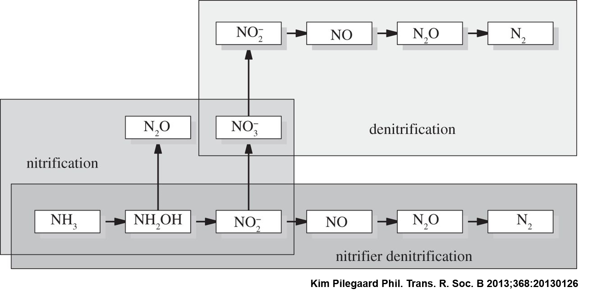</center>  

# Background

## Worked on N~2~O during Masters  { .cover .white }  
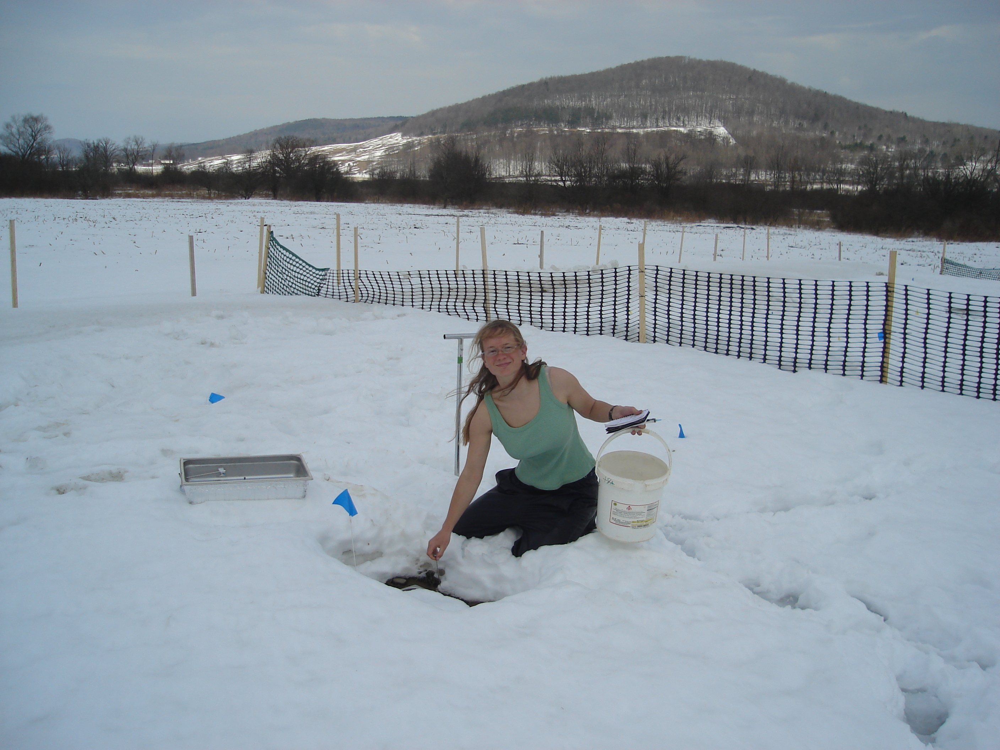
 
## Before that worked at USDA-ARS North Central Soil Conservation Research Lab in Morris, MN  
<center></center>

## Worked on 4 N~2~O experiments May-December  
<center>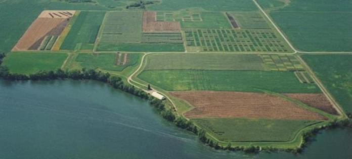</center>

## Greenhouse Gas Emission from Contrasting Management Scenarios in the Northern Corn Belt   
<center>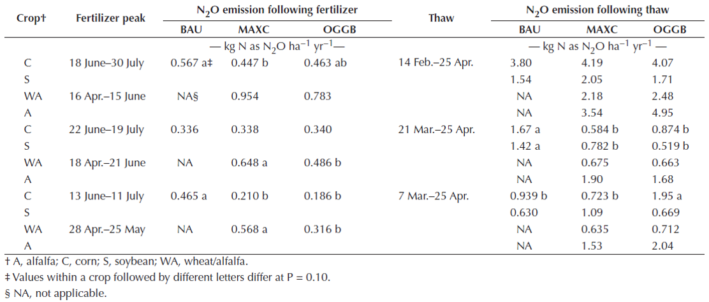</center>  
`r pbr("Johnson et al., 2010, SSSAJ 74:396-406")`

## Freeze-Thaw N~2~O Peaks { .cover .white }  
  
<p style="color:white">Great White Whale of Greenhouse Gases </p>  

## Emissions of nitrous oxide from soils - *Nature* 1982, Duxbury et al.   
  + In alfalfa, 66% of annual emissions in 2 week period during spring  
  + 27% of annual emissions during 2 days of spring
<center>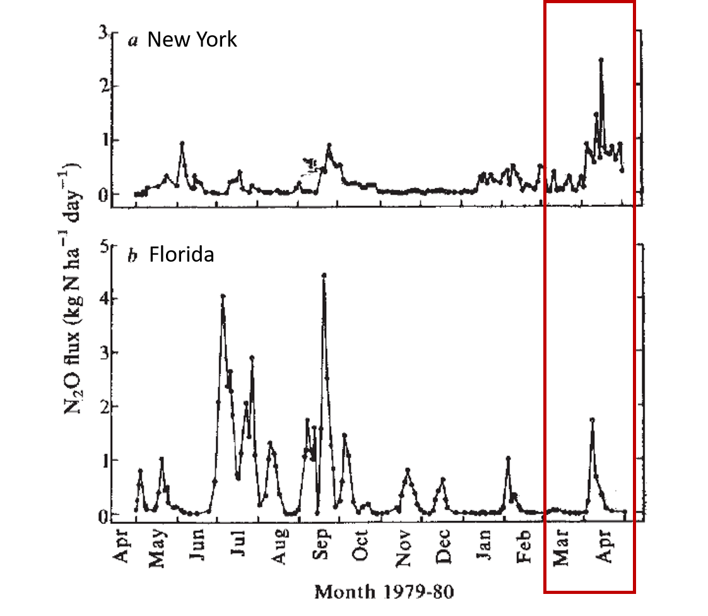</center>
`r pbr("Duxbury et al., 1982, Nature 298:462-464")`

## Seasonal variability in emission of nitrous oxide from soil, *Geophysical Research Letters*, 1980, Bremner et al.   
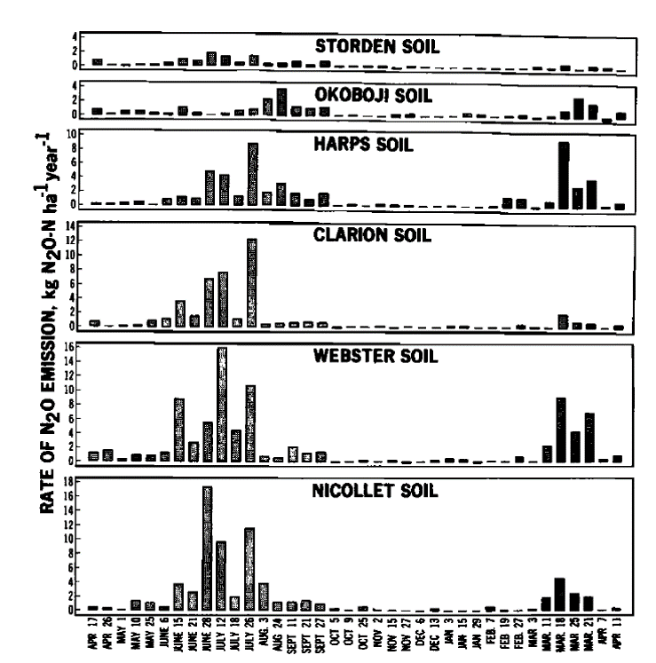
`r pbr("Bremner et al., 1980, Geophysical Research Letters 7:641-644")`  

## What causes peaks in the spring? { .cover .white }  
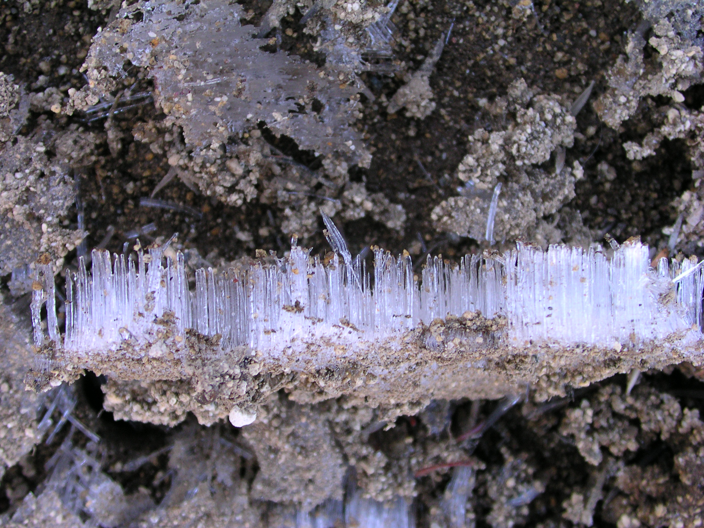  
<p style="color:white"> Wet conditions leading to anaerobic respiration (denitrification) </p>  

## What causes peaks in the spring?  
  + Big flush of labile carbon and nitrogen as frozen microbes and plant cells thaw and burst  
  + Drop in pH as soil solution is flooded with new solutes  
  + Trapped gases not a big contributer to spring peaks  
  
## What causes peaks in the spring?  
Nitrate reduction efficiency plays a huge role in spring peaks  
<center>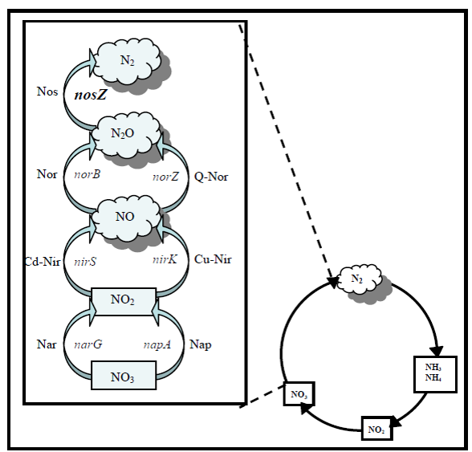</center> 

# What causes inefficiency?  

#Cold?

##  
<center>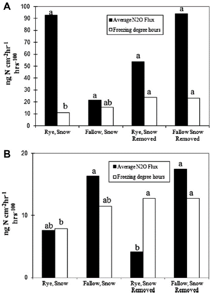</center>
`r pbr("Dietzel et al., 2011, Soil Biology & Biochemistry 43:1989-1991")`

## More evidence from Canada

<center>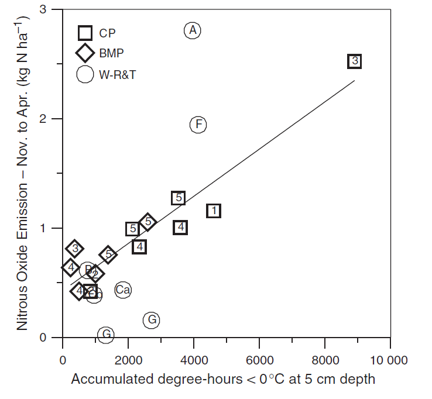</center>
`r pbr("Wagner-Riddle et al., 2007, Global Change Biology 13:1722-1736")`

# Colder winters -> more N~2~O    

##  

<center>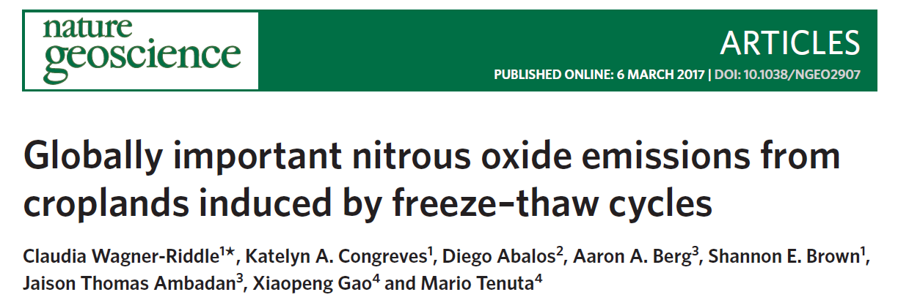</center>  

## Modeled spring emissions from freezing degree days  

<center>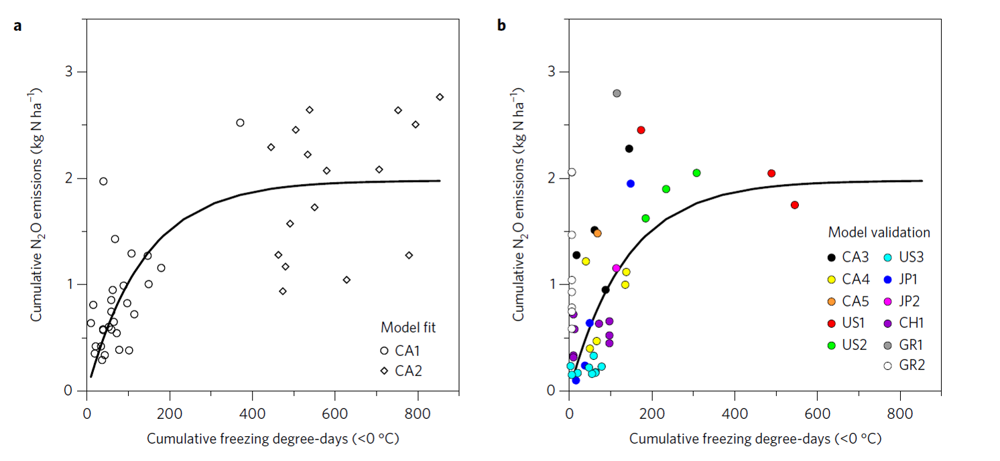</center>  

## Scaled model up to find current estimates miss ~ 28% of annual emissions 

<center>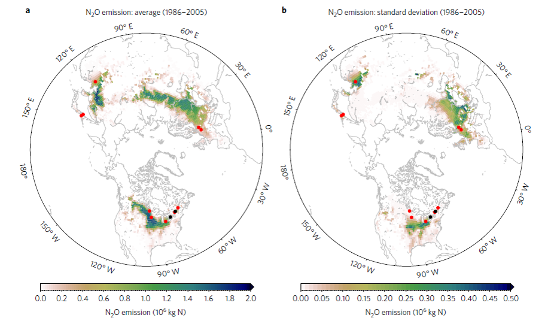</center>  

## But acknowledged parameters beyond freezing degrees days are needed

<center>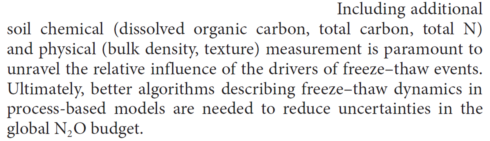</center>

#Let's do this 

## USDA-ARS-GRACEnet    
**G**reenhouse gas **R**eduction through **A**gricultural **C**arbon **E**nhancement network  
<center>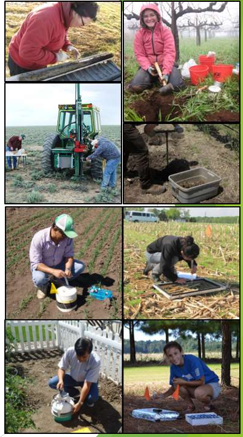</center>

## GRACEnet collection and sites  

<center>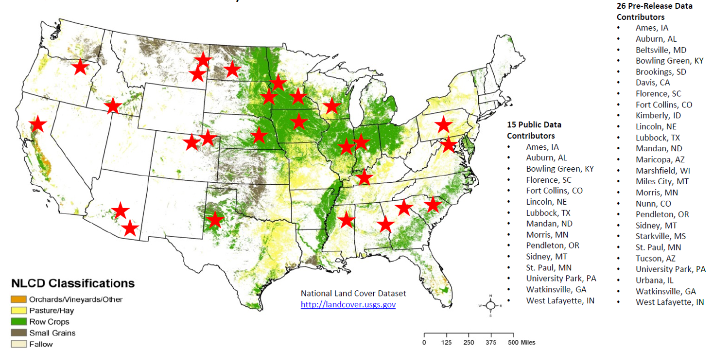</center>

##GRACEnet Pubs up to 2012  


##GRACEnet data is/was available in easily accessible public database  

## All available sites    

```{r, echo=FALSE, message = FALSE, warning = FALSE, warning = FALSE}
ars_map <- read_csv("../data/ars/ars_latlong.csv")%>%
  select(`Experimental Unit`, `Latitude of weather station, decimal degrees`, 
         `Longitude of weather station, decimal degrees`)%>%
  rename(name = `Experimental Unit`, lon = `Longitude of weather station, decimal degrees`, lat = `Latitude of weather station, decimal degrees`)

ars_box <- make_bbox(lon = ars_map$lon, lat = ars_map$lat, f = .1)

sq_map <- get_map(location = ars_box, maptype = "toner", source = "stamen")

ggmap(sq_map) + 
  geom_point(data = ars_map, mapping = aes(x = lon, y = lat), color = "purple", size = 4.5)+
  geom_point(data = ars_map, mapping = aes(x = lon, y = lat), color = "blue", size = 4.0)
```  

##Sites that experience freezing  

```{r, echo=FALSE,message = FALSE, warning = FALSE }
ars_cold_map<- ars_map%>%
  separate(name, c("state","exp"), sep = 3)%>%
  filter(state %in% c("INA", "INT", "INW", "MNM", "MNR", "NDM", "NVN", "PAH"))  

ggmap(sq_map) + 
  geom_point(data = ars_cold_map, mapping = aes(x = lon, y = lat), color = "purple", size = 4.5)+
  geom_point(data = ars_cold_map, mapping = aes(x = lon, y = lat), color = "blue", size = 4.0)  
```


##   
```{r, echo=FALSE, message = FALSE, warning = FALSE} 
viz<-read_csv("../data/ars/ars_cold_fluxes.csv")  

viz%>%
  filter(N2O < 1500)%>%
  filter(N2O > 0)%>%
  ggplot(aes(x=year, y=N2O))+
  geom_jitter(size=2, alpha=.3)+
  facet_wrap(~town)+
  ggtitle("GRACEnet Measurements")+
  xlab("Year")+ ylab((expression(paste("N2O-N (g ha" ^ "-1","day " ^ "-1",")"))))+
  theme(axis.text.x = element_text(colour="black", size=12),
       strip.text = element_text(face="bold", size=14))
```  

##  
```{r, echo=FALSE, message = FALSE, warning = FALSE}  
viz%>%
  filter(N2O < 1500)%>%
  filter(N2O > 0)%>%
  ggplot(aes(x=yday, y=N2O))+
  geom_jitter(size=2, alpha=.2)+
  #geom_vline(xintercept=150)+
  facet_wrap(~town)+
  ggtitle("GRACEnet Measurements")+
  xlab("Day of Year")+ ylab((expression(paste("N2O-N (g ha" ^ "-1","day " ^ "-1",")"))))+
  theme(axis.text.x = element_text(colour="black", size=12),
       strip.text = element_text(face="bold", size=14))
```  

##  
```{r, echo=FALSE, message = FALSE, warning = FALSE}  
annual_flux<-read_csv("../data/ars_annual_N2O.csv")

#3   
ggplot(annual_flux, aes(x=year, y=avg_N2O))+
  geom_point(size=2)+
  facet_wrap(~town)+
  ggtitle("Average Spring GRACEnet Fluxes")+
  xlab("Year")+ ylab((expression(paste("N2O-N (g ha" ^ "-1","day " ^ "-1",")"))))+
  theme(axis.text.x = element_text(colour="black", size=12),
       strip.text = element_text(face="bold", size=14))
```  

##  
```{r, echo=FALSE, message = FALSE, warning = FALSE}  
ggplot(annual_flux, aes(x=cold_sum, y=avg_N2O))+
  geom_point(size=3)+
  ggtitle("Average Spring Fluxes and Coldness of Winter")+
  xlab("Cumulative Daily Minimum Temperature")+ ylab((expression(paste("N2O-N (g ha" ^ "-1","day " ^ "-1",")"))))+
  theme(strip.text = element_text(face="bold", size=14))
```  

## Soil Hydrological Properties  
Clay (%)  
Sand (%)   
Silt (%)  
Fine Silt (%)  
Coarse Silt (%)  
Ks  
$\theta$~s~ (L L^1^) 
$\theta$~r~ (L L^1^) 

## Substrate Properties  
Organic Carbon  
Organic Matter  
Total Nitrogen  
C:N Ratio  

## Soil Chemical Properties  
pH  
Cation Exchange Capacity  
Exchangeable Mg  
Exchangeable K  
Exchangeable K Saturation  
Excahgeable Ca  
Base Saturation  

## Antecedant Weather Conditions  
How cold - sum of daily minimum temperatures below 0  
How warm - sum of daily maximum temperatures  
How sunny - sum of daily total radiation  
How wet - sum of daily precipitation  
How snowy - sum of daily snowfall  

## How do these contribute to magnitude of spring N~2~O emissions?
<center></center>

## Partial Least Squares (PLS) Regression  
* Has some similarities to Principal Components Analysis (PCA)  
* Good to use if predictors are correlated and contain similar predictive information  
* Can produce a predictive model  

`r pbr("Bjørn-Helge Mevik, Ron Wehrens and Kristian Hovde Liland (2016). pls: Partial Least Squares
  and Principal Component Regression.")`  

## Partial Least Squares (PLS) Regression  

<center>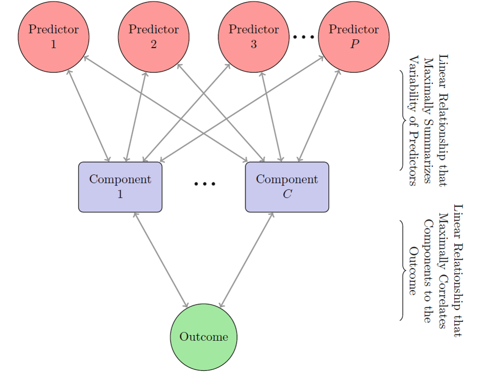</center>

`r pbr("Kuhn and Johnson, 2013, Applied Predictive Modeling DOI:10.1007/978-1-4614-6849-3")`  

##  
```{r, echo=FALSE, message = FALSE, warning = FALSE}  
flux_x<-select(annual_flux, -Unit_ID, -site, -series, -town, -avg_N2O, -log_avg_N2O,-year)

#Response variable, previously determined log transformation was better than none
flux_y<-select(annual_flux, log_avg_N2O)

#Not everything likes tibbles
flux_xish<-as.data.frame(unclass(flux_x))

#Centering and scaling, removing rows with NA
flux_x_processed<-preProcess(flux_xish, method = c("BoxCox", "center", "scale"), na.remove = TRUE)
flux_x_pro_mat<-predict(flux_x_processed, flux_xish) #Not 100% sure what this line does

#Put the x and y back together for PLS
yep_log<-cbind(flux_y, flux_x_pro_mat)


################## PLS ########################################## 
plsFit_log<-plsr(log_avg_N2O ~ ., validation = "LOO", data=yep_log)

varImp(plsFit_log)%>%
  rownames_to_column()%>%
  ggplot(aes(x=reorder(rowname, -Overall), y=Overall))+
  geom_bar(stat="identity")+
  coord_flip()+
  ggtitle("Weighted Importance of Predictor Variables")+
  theme(axis.title.x = element_blank(),
        axis.title.y = element_blank(),
        axis.text.y = element_text(colour="black", size=16),)
```  

##
```{r, echo=FALSE, message = FALSE, warning = FALSE}   
ggplot(annual_flux, aes(x=oc, y=avg_N2O))+
  geom_point(size=3)+
  geom_smooth(method='lm')+
  ggtitle("Average Spring Fluxes and Organic Matter")+
  xlab("Organic Matter (%)")+ ylab((expression(paste("N2O-N (g ha" ^ "-1","day " ^ "-1",")"))))
```  

##
```{r, echo=FALSE, message = FALSE, warning = FALSE}   
ggplot(annual_flux, aes(x=theta_s, y=avg_N2O))+
  geom_point(size=3) +
  geom_smooth(method="lm")+
  ggtitle("Average Spring Fluxes and Saturated Water Content")+
  xlab(expression(theta[s]))+ ylab((expression(paste("N2O-N (g ha" ^ "-1","day " ^ "-1",")"))))
```    

##
```{r, echo=FALSE, message = FALSE, warning = FALSE}   
ggplot(annual_flux, aes(x=ex_mg, y=avg_N2O))+
  geom_point(size=3) +
  geom_smooth(method="lm")+
  ggtitle("Average Spring Fluxes and Extractable Mg")+
  xlab("Extractable Mg")+ ylab((expression(paste("N2O-N (g ha" ^ "-1","day " ^ "-1",")"))))
```  

##
<center>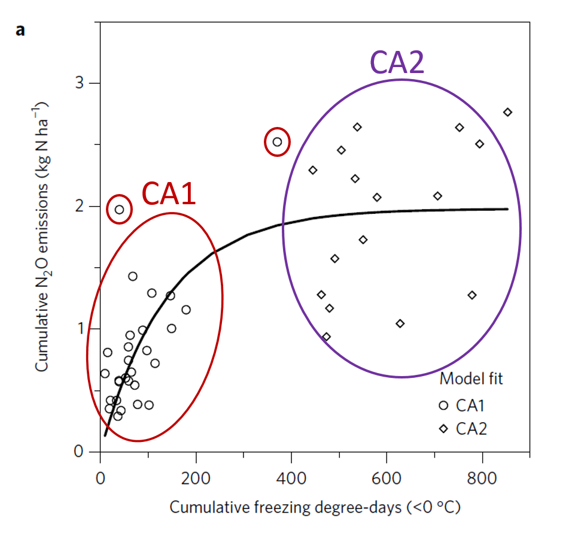</center>

##
```{r, echo=FALSE, message = FALSE, warning = FALSE}   
ggplot(annual_flux, aes(x=oc, y=avg_N2O))+
  geom_point(size=3) +
  geom_smooth(method="lm")+
  geom_text(aes(x=2.7, y=14.5), label = "CA1", size=5, color="red")+
  geom_label(aes(x=2.7, y=14.5), label = "CA1", size=5, color="red")+
  geom_text(aes(x=3.2, y=17.55), label = "CA2", size=5, color="purple")+
  geom_label(aes(x=3.2, y=17.55), label = "CA2", size=5, color="purple")+
  ggtitle("Average Spring Fluxes and Organic Matter")+
  xlab("Organic Matter (%)")+ ylab((expression(paste("N2O-N (g ha" ^ "-1","day " ^ "-1",")"))))
```  

## 
```{r, echo=FALSE, message = FALSE, warning = FALSE}   
ggplot(annual_flux, aes(x=theta_s, y=avg_N2O))+
  geom_point(size=3) +
  geom_smooth(method="lm")+
  geom_text(aes(x=.41, y=7.5), label = "CA1", size=5, color="red")+
  geom_label(aes(x=.41, y=7.5), label = "CA1", size=5, color="red")+
  geom_text(aes(x=.53, y=17.75), label = "CA2", size=5, color="purple")+
  geom_label(aes(x=.53, y=17.75), label = "CA2", size=5, color="purple")+
  ggtitle("Average Spring Fluxes and Saturated Water Content")+
  xlab(expression(theta[s]))+ ylab((expression(paste("N2O-N (g ha" ^ "-1","day " ^ "-1",")"))))
```  

## 

<center>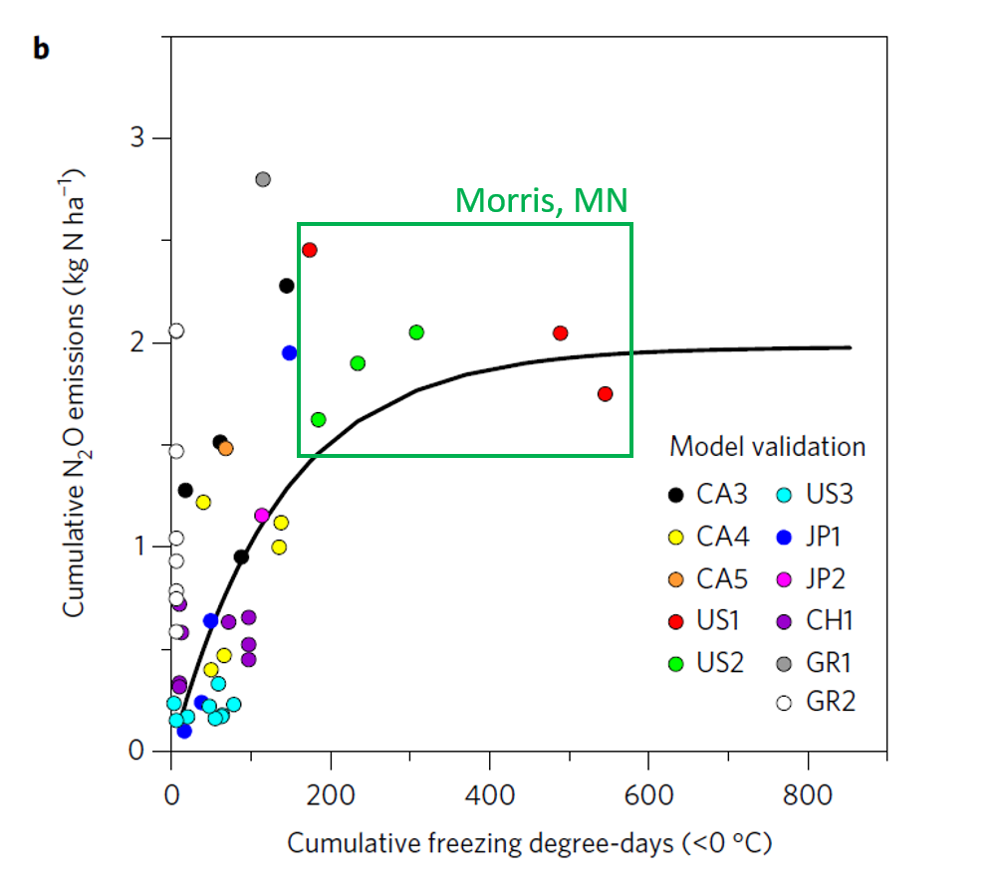</center>  

##
```{r, echo=FALSE, message = FALSE, warning = FALSE}   
ggplot(annual_flux, aes(x=oc, y=avg_N2O))+
  geom_point(size=3) +
  geom_smooth(method="lm")+
  geom_text(aes(x=2.7, y=14.5), label = "CA1", size=5, color="red")+
  geom_label(aes(x=2.7, y=14.5), label = "CA1", size=5, color="red")+
  geom_text(aes(x=3.2, y=17.55), label = "CA2", size=5, color="purple")+
  geom_label(aes(x=3.2, y=17.55), label = "CA2", size=5, color="purple")+
  geom_point(aes(x=oc, y=avg_N2O), data=filter(annual_flux, town == "Morris"),  color='red', size=4)+
  ggtitle("Average Spring Fluxes and Organic Matter")+
  xlab("Organic Matter (%)")+ ylab((expression(paste("N2O-N (g ha" ^ "-1","day " ^ "-1",")")))) 
```  

## 
```{r, echo=FALSE, message = FALSE, warning = FALSE}   
ggplot(annual_flux, aes(x=theta_s, y=avg_N2O))+
  geom_point(size=3) +
  geom_smooth(method="lm")+
  geom_text(aes(x=.41, y=7.5), label = "CA1", size=5, color="red")+
  geom_label(aes(x=.41, y=7.5), label = "CA1", size=5, color="red")+
  geom_text(aes(x=.53, y=17.75), label = "CA2", size=5, color="purple")+
  geom_label(aes(x=.53, y=17.75), label = "CA2", size=5, color="purple")+
  geom_point(aes(x=theta_s, y=avg_N2O), data=filter(annual_flux, town == "Morris"),  color='red', size = 4)+
  ggtitle("Average Spring Fluxes and Saturated Water Content")+
  xlab(expression(theta[s]))+ ylab((expression(paste("N2O-N (g ha" ^ "-1","day " ^ "-1",")"))))
```  


# What does this mean?  

## What does this mean?  

* Across large spatial scales, freezing degree days is not a good predictor of spring N~2~O fluxes  
* Within a specific soil type, we currently don't have enough data to quantify the effect of winter weather conditions on spring N~2~O emissions 
* **Soil characteristics drive spatial variability of N~2~O emissions.**  
  +  Organic Matter  
  +  $\theta$~s~   
  +  Clay  
  +  Exchangeable Mg  
  
## Early spring emissions are still important, neglected, and probably underestimated
* Need better (continuous) and more measurements  

<center></center>

## Need better modeling of this phenomenon  

* Relationships are too complex for large-scale modeling  
* N~2~O timing is very dynamic  
* Cold winters manifest in soil conditions  
* Daily time step, mechanistic model would make best predictions  
* **I am bringing spring N~2~O emissions to APSIM**  
* Then we can scale up (still dependent on good soils maps)

## Nitrous oxide reduction efficiency drivers still in question  
Variables listed should lead to more denitrification, but what controls *nosZ*?

<center></center>  

## Thank You!  

* Agriculture and Food Research Initiative competitive grant number 2016-67012-25170 for the money  
* USDA-ARS for all the data  
* R Community for all the tools 
* Integrated Cropping Systems lab (Archontoulis) for all the support  

# Questions?  

